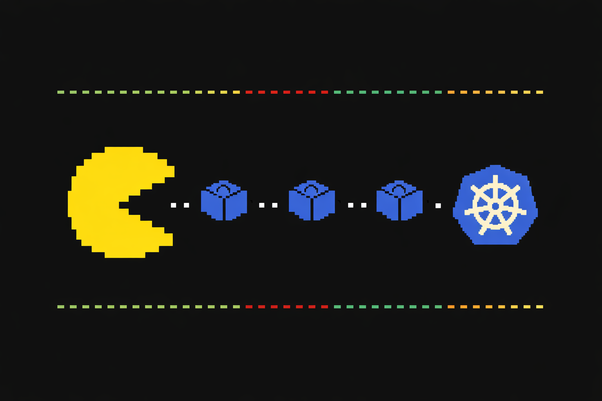

<p align="center">
  
</p>

# EatTheCluster

A Pacman chaos engine for Kubernetes. Eat your cluster resources before monitoring catches you.

```
make build     # build
make release   # build without debug symbols
make run       # build and run
make clean     # clean build artifacts
```
